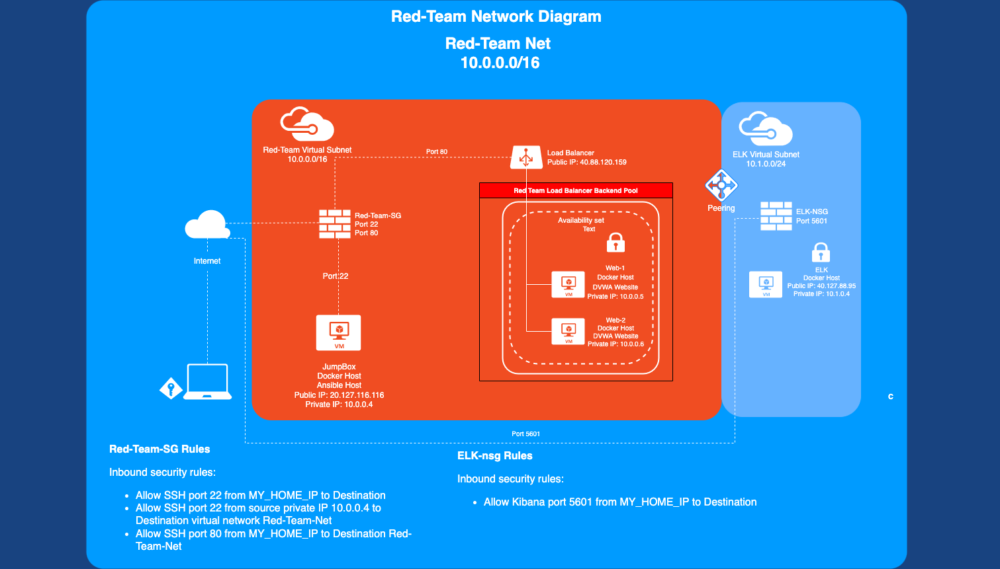
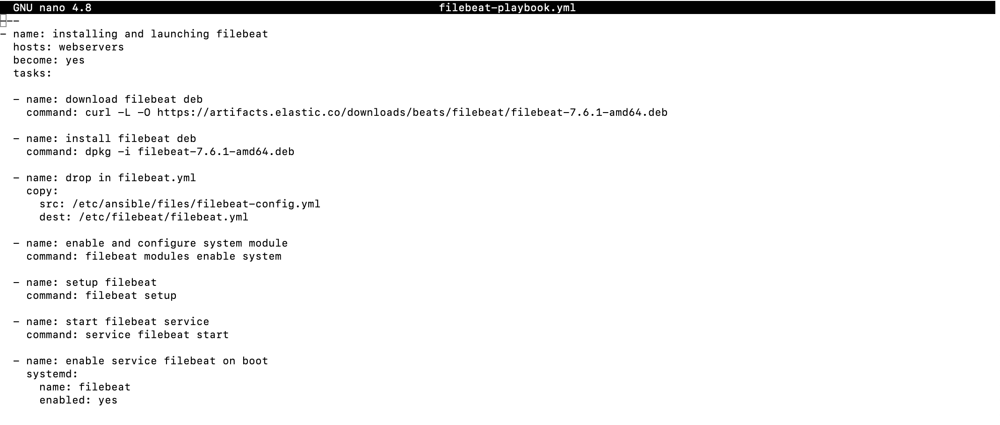
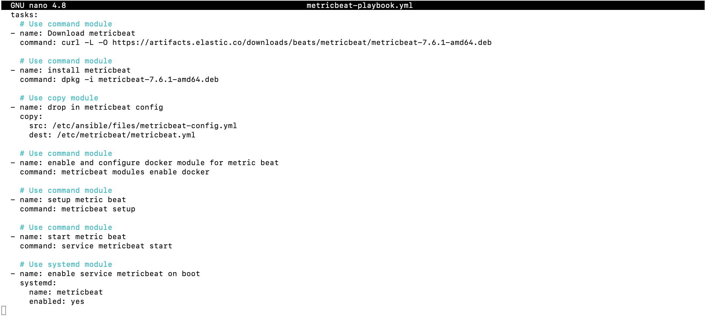
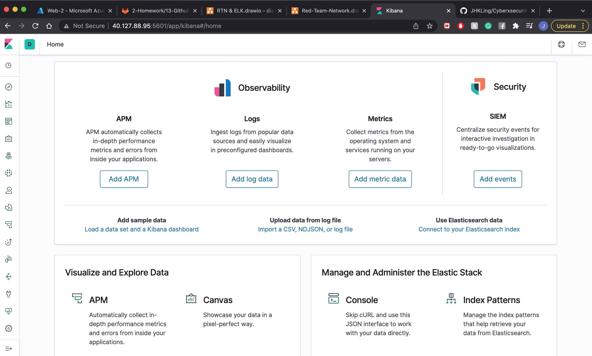

## Automated ELK Stack Deployment

The files in this repository were used to configure the network depicted below.

These files have been tested and used to generate a live ELK deployment on Azure. They can be used to either recreate the entire deployment pictured above. Alternatively, select portions of the playbook file may be used to install only certain pieces of it, such as Filebeat.

  - ELK.yml
  - Filebeat.yml
  - Metricbeat.yml

This document contains the following details:
- Description of the Topologu
- Access Policies
- ELK Configuration
  - Beats in Use
  - Machines Being Monitored
- How to Use the Ansible Build

### Description of the Topology

The main purpose of this network is to expose a load-balanced and monitored instance of DVWA, the D*mn Vulnerable Web Application.

Load balancing ensures that the application will be highly available, in addition to restricting access to the network.
- What aspect of security do load balancers protect?
Load Balancing plays an important security role as computing moves evermore to the cloud. It is a process of distributing traffic to multiple servers. The off-loading function of a load balancer defends an organization against distributed denial-of-service (DDoS) attacks. The load balancer usually sits between the client devices and the webservers. It ensures the traffic is distributed accordingly. It does this by shifting attack traffic from the corporate server to a public cloud provider.

- What is the advantage of a jump box? 
A jump box is a secure computer that all admins first connect to before launching any administrative task or use as an origination point to connect to other servers or untrusted environments. The purpose of a jump box is to be the only gateway (usually port 22/SSH) for access to your infrastructure reducing the size of any potential attack surface. The advantage of having jump box is that it is hardened and very secure in a way that only a few of the limited sevices that are running on a machine when the attackers try to target and attack. 

Integrating an ELK server allows users to easily monitor the vulnerable VMs for changes to the files and system metrics.
- What does Filebeat watch for?
Filebeat is a lightweight shipper for forwarding and centralizing log data installed as an agent on the machine's servers. Filebeat monitors the log files or locations that you specify, collects log events, and forwards them either to Elasticsearch or Logstash for indexing.

- What does Metricbeat record?
Metricbeat is a lightweight agent that can be installed on target servers to periodically collect metric data from your target servers, this could be operating system metrics such as CPU or memory or data related to services running on the server. It can also be used to monitor other beats and ELK stack itself.

The configuration details of each machine may be found below.

| Name     | Function | IP Address | Operating System |
|----------|----------|------------|------------------|
| Jump Box |Gateway   | 10.0.0.4   | Linux (Ubuntu)   |
| Web-1    |WebServer | 10.0.0.5   | Linux (Ubuntu)   |
| Web-2    |Webserver | 10.0.0.6   | Linux (Ubuntu)   |
| ELK      |Monitoring| 10.1.0.4   | Linux (Ubuntu)   |

### Access Policies

The machines on the internal network are not exposed to the public Internet. 

Only the Jump Box machine can accept connections from the Internet. Access to this machine is only allowed from the following IP addresses:
- 40.88.120.159

Machines within the network can only be accessed by ELK Monitoring.
- 40.127.88.95

A summary of the access policies in place can be found in the table below.

| Name    | Publicly Accessible  |       Allowed IP Addresses      |         
|----------|---------------------|---------------------------------|
| Jump Box | Yes                 |Public IP/10.0.0.0/16/10.1.0.0/16|
| Web-1    | No                  |10.0.0.0/16 / 10.1.0.0/16        |
| Web-2    | No                  |10.0.0.0/16 / 10.1.0.0/16        |
| ELK      | Yes                 |Public IP/10.0.0.0/16/ 10.1.0.0/16|
### Elk Configuration

Ansible was used to automate configuration of the ELK machine. No configuration was performed manually, which is advantageous because Ansible can automate IT environments whether they are hosted on traditional bare metal servers, virtualization platforms, or in the cloud. It can also automate the configuration of a wide range of systems and devices such as databases, storage devices, networks, firewalls, and many others. It also allows us to write the steps into the playbook to ensure every servers receive the same configuration.

The playbook implements the following tasks:
- Update apt cache
- Install docker.io
- Install pip
- Change the max map count to 262144
- Download the sebp/elk container image and publish ports 5601, 9200 & 5044
- Enable docker service on boot

The following screenshot displays the result of running `docker ps` after successfully configuring the ELK instance.

### Target Machines & Beats
This ELK server is configured to monitor the following machines:
- Web-1 - 10.0.0.5
- Web-2 - 10.0.0.6

We have installed the following Beats on these machines:
- Filebeat 7.6.1
- Metricbeat 7.6.1

These Beats allow us to collect the following information from each machine:
- Filebeat collects the log events/information from the logs file or location in the system that you specify. 
- Metricbeat collects information such as metric data from your target servers or CPU and memory utilisation.

### Using the Playbook
In order to use the playbook, you will need to have an Ansible control node already configured. Assuming you have such a control node provisioned: 

SSH into the control node and follow the steps below:
- Copy the elk.yaml file to /etc/ansible/ folder on the docker provisioner.
- Update the /etc/ansible/hosts file to include the private IP address of the ELK VM 10.1.0.4
- Run the playbook, and navigate to http://ELK-VM-PUBLIC-IP:5601/app/kibana to check that the installation worked as expected.
- Copy both the filebeat-playbook.yml and metricbeat-playbook.yml files to /etc/ansible/ folder on the docker provisioner.
- Run the command ansible-playbook filebeat-playbook.yml to run the filebeat-playbook.yml that we have created and monitor the nodes from webserver.
- Run the command ansible-playbok metricbeat-playbook.yml to run the metricbeat-playbook.yml that we have created and monitor the nodes from webserver.
- Navigate to http://ELK-VM-PUBLIC-IP:5601/app/kibana and check yo see filebeat and metricbeat entries.

